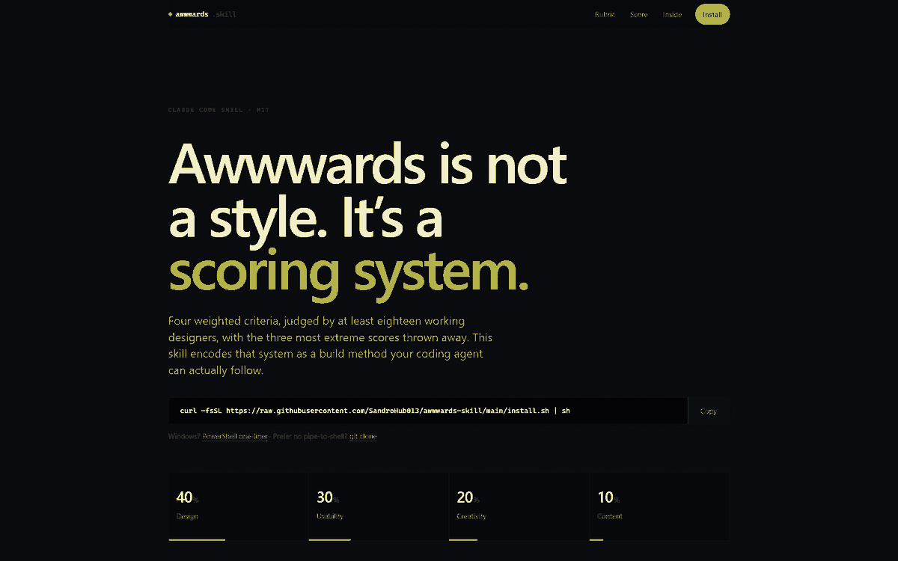

<div align="center">

# awwwards skill

**Awwwards is not a style. It's a scoring system.**
This skill encodes that system as a build method your coding agent can actually follow.

[](LICENSE)
[](https://code.claude.com/docs/en/skills)
[](https://github.com/SandroHub013/awwwards-skill/stargazers)
[](https://sandrohub013.github.io/awwwards-skill/)

[**Live demo →**](https://sandrohub013.github.io/awwwards-skill/) · [Read SKILL.md](SKILL.md) · [Browse the 18 references](references/)



</div>

```sh
curl -fsSL https://raw.githubusercontent.com/SandroHub013/awwwards-skill/main/install.sh | sh
```

<details>
<summary><b>Windows, plain git, or Claude Code plugin</b></summary>

```powershell
# Windows PowerShell
irm https://raw.githubusercontent.com/SandroHub013/awwwards-skill/main/install.ps1 | iex
```

```sh
# no pipe to shell
git clone https://github.com/SandroHub013/awwwards-skill.git ~/.claude/skills/awwwards
```

```
# as a versioned Claude Code plugin, from inside Claude Code
/plugin marketplace add SandroHub013/awwwards-skill
/plugin install awwwards@awwwards-skill
```

All routes install to `~/.claude/skills/awwwards`. Re-run the one-liner to update.
Remove with `rm -rf ~/.claude/skills/awwwards`.

</details>

Then restart Claude Code (or `/reload-skills`) and say:

```
/awwwards                                        read the workflow
"build me an awwwards-level site for my studio"  build
"score my site against the Awwwards criteria"    audit an existing site
```

---

## Why this exists

Most "make it look premium" prompts produce the same competent, forgettable page. Awwwards
publishes the actual mechanism, and it changes what you should optimise for:

| Criterion  | Weight | |
|---|---|---|
| Design     | **40%** | hierarchy, type system, colour intent, spacing, states, consistency |
| Usability  | **30%** | navigation, speed, responsiveness, accessibility, Core Web Vitals |
| Creativity | **20%** | one idea, one signature moment, original interaction |
| Content    | **10%** | real copy, real imagery, art direction and content authored together |

At least **18 jurors**, and the **3 most extreme scores are dropped automatically**.

Two consequences drive every rule in this skill:

1. **You don't win because one juror loves it.** The outliers are discarded, so you win by
   giving no juror a reason to mark you down. Usability is 30% *and* objectively
   measurable, which is why it quietly eliminates the most beautiful sites.
2. **One signature moment beats twenty effects.** Every recent Site of the Day has a single
   interaction people describe out loud. Scattered effects read as noise and cost points in
   Design *and* Usability.

Thresholds: **≥ 6.5** Honorable Mention (jury *and* users, independently) · **highest of the
day** Site of the Day · **> 7** Developer Award, re-scored by a developer jury.

## Built with it

Three demo sites, each produced by running the method end to end, each scored against the
same rubric with the numbers printed rather than implied:

| | |
|---|---|
| [**wonk**](https://sandrohub013.github.io/awwwards-skill/demos/wonk/) | A Fraunces specimen for one number: `WONK` defaults to 1, so the typeface ships crooked. Editorial, no WebGL. [Score](docs/demos/wonk/SCORE.md) |
| [**descent**](https://sandrohub013.github.io/awwwards-skill/demos/descent/) | 8,556 real earthquakes of 2025 at their own depth — a quake map is the top face of a solid. WebGL, no webfont. [Score](docs/demos/descent/SCORE.md) |
| [**nothing here was filmed**](https://sandrohub013.github.io/awwwards-skill/demos/reel/) | A reel whose footage came out of a model — prompt, cost and shipped bytes printed beside every clip. Video-first. [Score](docs/demos/reel/SCORE.md) |

None uses stock imagery or placeholder copy. The first two are measured from primary
sources: a font binary and the USGS catalog. The third is generated footage, which the
skill would otherwise forbid — so its provenance is the subject of the page rather than a
line in the footer, and the ledger of what each clip cost is published with it.

## What you get

An 8-phase workflow (concept → art direction → signature moment → build → craft → hardening
→ self-score → submission) plus 18 references the agent loads only when the current phase
needs them.

| | |
|---|---|
| [`01-scoring`](references/01-scoring.md) | Rubric decoded, thresholds, self-scoring sheet |
| [`02-concept`](references/02-concept.md) | Concept statement, 7 art-direction registers, narrative spines |
| [`03-typography`](references/03-typography.md) | Fluid scale, variable fonts, zero-CLS loading, kinetic type |
| [`04-color-and-layout`](references/04-color-and-layout.md) | OKLCH colour roles, contrast, grid, spacing, composition |
| [`05-motion`](references/05-motion.md) | Easing language, choreography, the signature moment |
| [`06-stack`](references/06-stack.md) | Stack decision matrix, current versions, project structure |
| [`07-scroll`](references/07-scroll.md) | Lenis + ScrollTrigger, native scroll-driven CSS, pinning |
| [`08-webgl`](references/08-webgl.md) | Three.js patterns, DOM sync, shaders, GPU budgets, disposal |
| [`09-transitions`](references/09-transitions.md) | Preloaders, page transitions, View Transitions API |
| [`10-interactions`](references/10-interactions.md) | Cursor, magnetic, hover, sound, micro-detail checklist |
| [`11-performance`](references/11-performance.md) | Budgets, Core Web Vitals, asset pipeline, frame budget |
| [`12-accessibility`](references/12-accessibility.md) | WCAG 2.2 AA for motion-heavy sites, Developer Award |
| [`13-responsive`](references/13-responsive.md) | Mobile Excellence, touch, breakpoint discipline |
| [`14-anti-patterns`](references/14-anti-patterns.md) | Score killers, ordered by how fast a juror notices |
| [`15-audit`](references/15-audit.md) | Runnable real-browser verification, not guessed numbers |
| [`16-submission`](references/16-submission.md) | Timing, thumbnail, deploy freeze, other awards |
| [`17-video`](references/17-video.md) | Video-first sites: encoding ladder, HLS, preview patterns, accessible player |
| [`18-deepdive`](references/18-deepdive.md) | Dissect an awarded site into a reusable idea card: evidence, not assertion |

Plus a [no-build starter template](assets/templates/starter/) that encodes the doctrine, a
[DOM-synced WebGL layer](assets/templates/webgl-hero/gl.js) with real teardown, and a
[printable pre-flight checklist](assets/checklists/pre-flight.md).

## It measures instead of guessing

Ask it to score a site and it drives a real Chrome: throttled cold load, breakpoint sweep
from 320px, keyboard pass, reduced-motion pass, contrast and heading structure, then reports
**measured** LCP / CLS / INP / payload alongside a per-criterion score and the three
highest-leverage fixes. No invented numbers.

The [showcase page](https://sandrohub013.github.io/awwwards-skill/) was built with the skill
and audited by it. Lighthouse, verified: **Accessibility 100 · Best Practices 100 · SEO 100**,
0 failed audits. Live on GitHub Pages it loads in **15 KB total** (2.8 KB of JavaScript) with
LCP 0.48 s and CLS 0.000, and it ships **zero animation libraries**, because reference 06 says
pick the smallest stack that expresses the concept and a documentation page is not a spatial
experience. It also reports its own live metrics, in the page, measured on your device.

## Non-negotiables

The hard rules. Breaking any one caps a site below 7.

- 60 fps sustained on a **mid-range** device, not on your laptop
- LCP < 1.5 s · CLS < 0.05 · INP < 100 ms · first view < 3 MB
- `prefers-reduced-motion` honoured everywhere, with equivalent non-animated cues
- Keyboard operable: visible focus, logical order, skip link, no traps
- Mobile is **designed**, not shrunk. Hover-only interactions have touch equivalents
- Real content. No lorem ipsum, no stock, ever
- Same design language on inner pages, forms, footer and 404
- No template smell. A jury of working designers recognises defaults in seconds

## Contributing

Issues and PRs welcome, especially: corrections to the scoring facts, newer library
versions, additional art-direction registers, and audit steps that catch something the
current pass misses. Keep the prose dense and the claims verifiable.

Conventions, sync checklist and PR rules: [CONTRIBUTING.md](CONTRIBUTING.md).

## License

[MIT](LICENSE). Use it commercially, fork it, ship it.

"Awwwards" is a trademark of Awwwards S.L. This is an independent, unofficial reference and
is not affiliated with, endorsed by, or sponsored by Awwwards.

<div align="center">

**If this saved you a redesign, a star helps other people find it.**

</div>
